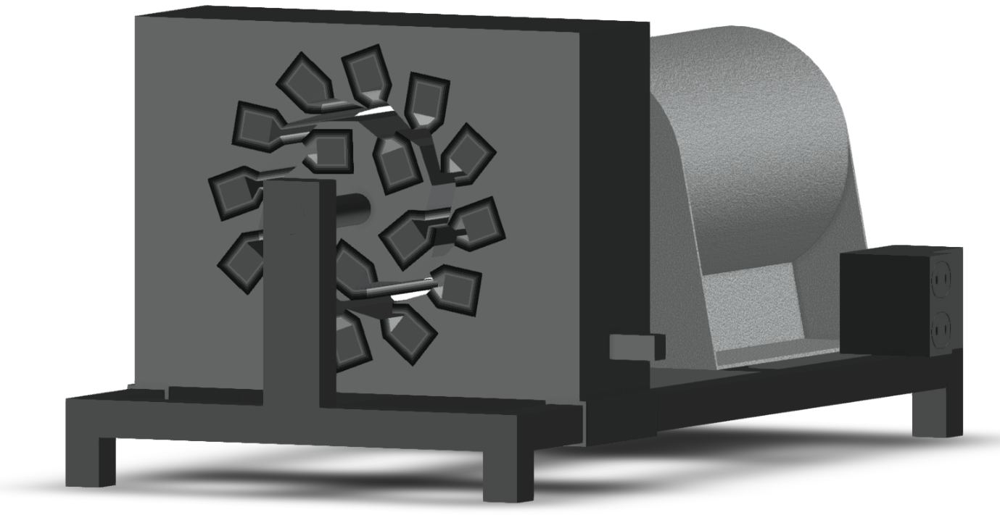

# Magnetic Repulsion Motor and Generator

This repository contains the following files, along with their translations if applicable:
- Generator and Motor Patent (text, certified provisional)
- [Generator Construction Instructions](https://github.com/bannonmaher/magnetic_repulsion_motor_and_generator/blob/master/magnetic_repulsion_generator_construction_instructions.md)
- [Motor Construction Instructions](https://github.com/bannonmaher/magnetic_repulsion_motor_and_generator/blob/master/magnetic_repulsion_motor_construction_instructions.md)
- Autodesk three-dimensional model as well as individual components separated from primary model for manufacturing
